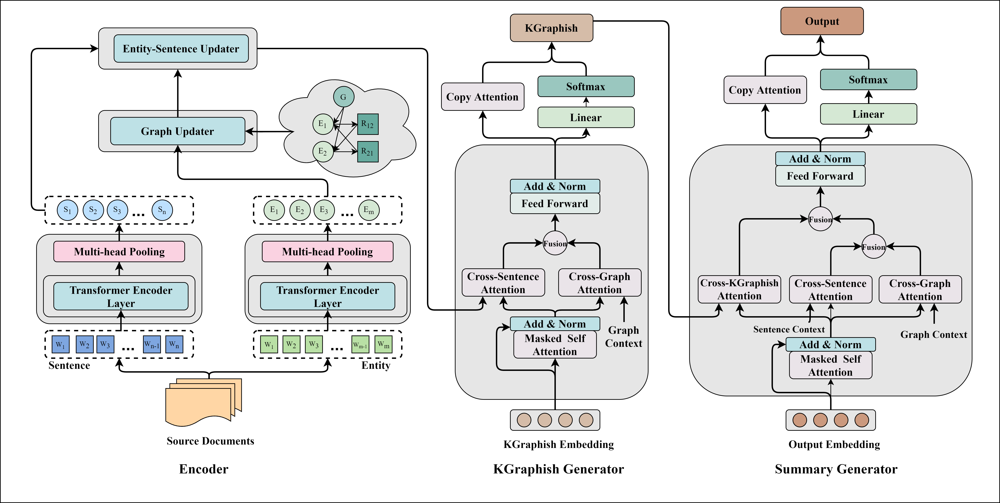

# Multi-Document Scientific Summarization from a Knowledge Graph-Centric View
This is the Pytorch implementation for [Multi-Document Scientific Summarization from a Knowledge Graph-Centric View], accepted by COLING 2022.

<p align="center">
 
</p>

## Requirements
* Python == 3.6.3
* Pytorch == 1.5.0
* transformers == 4.10.3
* dgl-cu101 == 0.6.1

## Usage
1. Create folder `datasets`, `cache`, `trained_model`, `result` under the root directory.

2. Download Multi-Xscience Dataset from [here](https://github.com/yaolu/Multi-XScience). Put Multi-Xscience under `datasets`.

3. Dataset Preprocessing:


## Training a new model
The MT datasets should be named in the format of ``train.{language code}, dev.{language code}, test.{language code}``, e.g "train.de".
Suppose we put the WMT14-ENDE data sets under ``data/wmt14-ende/real-bpe/``, we can train FlowSeq over this data on one node with the
following script:
```bash
cd experiments

python -u distributed.py  \
    --nnodes 1 --node_rank 0 --nproc_per_node <num of gpus per node> --master_addr <address of master node> \
    --master_port <port ID> \
    --config configs/wmt14/config-transformer-base.json --model_path <path to the saved model> \
    --data_path data/wmt14-ende/real-bpe/ \
    --batch_size 2048 --batch_steps 1 --init_batch_size 512 --eval_batch_size 32 \
    --src en --tgt de \
    --lr 0.0005 --beta1 0.9 --beta2 0.999 --eps 1e-8 --grad_clip 1.0 --amsgrad \
    --lr_decay 'expo' --weight_decay 0.001 \
    --init_steps 30000 --kl_warmup_steps 10000 \
    --subword 'joint-bpe' --bucket_batch 1 --create_vocab 
```
After training, under the <path to the saved model>, there will be saved checkpoints, `model.pt`, `config.json`, `log.txt`, 
`vocab` directory and intermediate translation results under the `translations` directory.

#### Note:  
 - The argument --batch_steps is used for accumulated gradients to trade speed for memory. The size of each segment of data batch is batch-size / (num_gpus * batch_steps).
 - To train FlowSeq on multiple nodes, we provide a script for the slurm cluster environment `/experiments/slurm.py` or please
refer to the pytorch distributed parallel training [tutorial](https://pytorch.org/tutorials/intermediate/dist_tuto.html).
 - To create distillation dataset, please use [fairseq](https://github.com/pytorch/fairseq/blob/master/examples/translation/README.md#neural-machine-translation) to train a Transformer model
and translate the source data set.

## Translation and evalutaion
```bash
cd experiments

python -u translate.py \
    --model_path <path to the saved model> \
    --data_path data/wmt14-ende/real-bpe/ \
    --batch_size 32 --bucket_batch 1 \
    --decode {'argmax', 'iw', 'sample'} \
    --tau 0.0 --nlen 3 --ntr 1
```
Please check details of arguments [here](https://github.com/XuezheMax/flowseq/blob/master/experiments/options.py#L48).

To keep the output translations original order of the input test data, use `--bucket_batch 0`.

## References
```
@inproceedings{flowseq2019,
    title = {FlowSeq: Non-Autoregressive Conditional Sequence Generation with Generative Flow},
    author = {Ma, Xuezhe and Zhou, Chunting and Li, Xian and Neubig, Graham and Hovy, Eduard},
    booktitle = {Proceedings of the 2019 Conference on Empirical Methods in Natural Language Processing},
    address = {Hong Kong},
    month = {November},
    year = {2019}
}
```